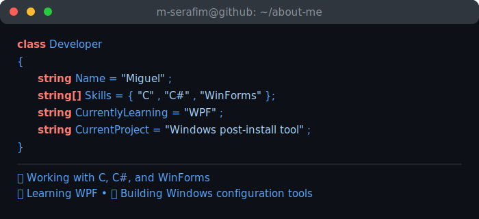

  

  

---

### 👨‍💻 About Me

  

---

### 🛠️ Tech Stack

---

### 🐍 Contribution Snake

<picture>
  <source media="(prefers-color-scheme: dark)" srcset="https://raw.githubusercontent.com/m-serafim/m-serafim/output/github-contribution-grid-snake-dark.svg">
  <source media="(prefers-color-scheme: light)" srcset="https://raw.githubusercontent.com/m-serafim/m-serafim/output/github-contribution-grid-snake.svg">
  
</picture>

  

  

